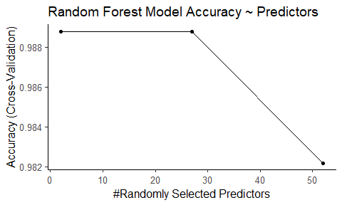
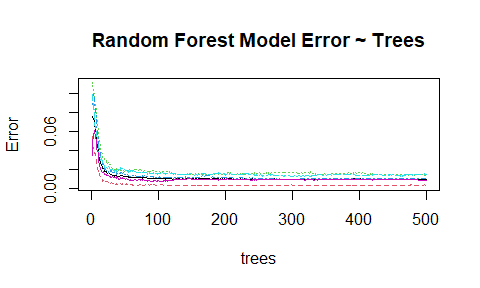

## Overview: Fitness Tracking: Performance versus Regularity
Fitness tracking focuses on regularity of exercise rather than how well exercise is performed. The goal of this project was to predict the manner in which subjects performed barbell lifts, using accelerometer data from belt, forearm, arm, and dumbbell. There were 5 performance methods, stored in the "classe" variable, that were either 'correct' and 'incorrect'. Using parallel processing in caret, data were trained using four different algorithms: decision tree, resampled decision tree, random forest, and resampled random forest. All models used cross validation via the trcontrol function in caret. Decision trees are a good choice for categorical variables but the decision tree accuracy was no better than could be expected by chance. The resampled decision tree using the bag method balances bias against variance through an across resampled models--that increased accuracy to 0.962. The highest accuracy was that of the random forest model (0.995) with low out of sample error (0.005)--the resampled random forest model using boosting was similar to resampled tree accuracy at 0.963. Given the fitted model plots there is potential for colinearity so the accuracy might be inflated and the model over-fitted. Domain expertise in exercise physiology would be helpful in understanding which of the 27 (out of 52 variables) were the most important at model accuracy peak.

## Data Processing
**Load required packages**

```r
library(dplyr); library(GGally); library(caret); library(rattle)
library(party); library(rpart.plot); library(randomForest)
library(doParallel); library(ggplot2); library(ggpubr)
```

**Get train and test data.** The data are found here: http://groupware.les.inf.puc-rio.br/har. More information on the data is found here:
http://web.archive.org/web/20161224072740/http:/groupware.les.inf.puc-rio.br/har (see the section on the Weight Lifting Exercise Dataset).

```r
trainUrl <- "https://d396qusza40orc.cloudfront.net/predmachlearn/pml-training.csv"
testUrl <- "https://d396qusza40orc.cloudfront.net/predmachlearn/pml-testing.csv"
training <- read.csv(url(trainUrl),na.strings=c("NA", "#DIV/0!", ""))
testing <- read.csv(url(testUrl),na.strings=c("NA","#DIV/0!",""))
names(training)[1:10]
```
**Clean Data.** Variables were removed from the both training and test sets if they were not related to the exercises defined above. Variables containing mostly NA values were also removed.

```r
#remove columns unrelated to exercise and classe
training <- training[,-c(1:7)]; testing <- testing[,-c(1:7)]
#remove columns with high NA values
training <- training[, colSums(is.na(training))==0]
testing <- testing[, colSums(is.na(testing))==0]
#examine new data dimensions
```
**Partition data.** The partition between training and test was 60/40. 

```r
#set random seed for reproducibility
set.seed(12345)
#partition data into training and test sets
inTrain <- createDataPartition(y=training$classe, 
    p=0.6,list=FALSE)
myTraining <- training[inTrain,]; myTesting <- training[-inTrain,]
#make classe a factor
myTraining$classe <- factor(myTraining$classe)
myTesting$classe <- factor(myTesting$classe)
```

## Parallel Processing
R uses 2 cores. There are some programs that allow users to set parallel to include more than 2 cores and this speeds up computational time. Four models were fit .

```r
#clean up previous parallel processing
#function source: https://stackoverflow.com/questions/25097729/un-register-a-doparallel-cluster
unregister_dopar <- function() {env <- foreach:::.foreachGlobals
  rm(list=ls(name=env), pos=env)}
#register parallel processing in caret; #specify cores (5)
cl <- makePSOCKcluster(6); registerDoParallel(cl)
```

## Machine Learning Best Model: Random Forest Model
The random forest model had marginally better accuracy than the resampled tree and resampled forest models. Random forest models tend to highly accurate even if prone to overfitting and harder to understand than decision trees. 

```r
control <- trainControl(method="cv", number=5)
fit_rf <- train(classe~., data=myTraining, method="rf",
    trControl=control, verbose=FALSE)
pred_rf <- predict(fit_rf, myTesting)
(confM_rf <- confusionMatrix(myTesting$classe, pred_rf))
```

```
## Confusion Matrix and Statistics
## 
##           Reference
## Prediction    A    B    C    D    E
##          A 2228    3    1    0    0
##          B   13 1503    2    0    0
##          C    0    4 1357    7    0
##          D    0    1    9 1276    0
##          E    0    0    3    7 1432
## 
## Overall Statistics
##                                           
##                Accuracy : 0.9936          
##                  95% CI : (0.9916, 0.9953)
##     No Information Rate : 0.2856          
##     P-Value [Acc > NIR] : < 2.2e-16       
##                                           
##                   Kappa : 0.9919          
##                                           
##  Mcnemar's Test P-Value : NA              
## 
## Statistics by Class:
## 
##                      Class: A Class: B Class: C Class: D Class: E
## Sensitivity            0.9942   0.9947   0.9891   0.9891   1.0000
## Specificity            0.9993   0.9976   0.9983   0.9985   0.9984
## Pos Pred Value         0.9982   0.9901   0.9920   0.9922   0.9931
## Neg Pred Value         0.9977   0.9987   0.9977   0.9979   1.0000
## Prevalence             0.2856   0.1926   0.1749   0.1644   0.1825
## Detection Rate         0.2840   0.1916   0.1730   0.1626   0.1825
## Detection Prevalence   0.2845   0.1935   0.1744   0.1639   0.1838
## Balanced Accuracy      0.9967   0.9962   0.9937   0.9938   0.9992
```
There are 52 predictors in the model but the accuracy peaks at ~27. Some domain expertise would be useful in determining which predictors are most valuable and perhaps an analysis for colinearity of variables would also be useful--when predictors are colinear, they can result in model over-fitting and falsely inflated accuracy. Colinear variables can be weighted to reduce their impact. The accuracy of the random forest model was high (0.995).

```r
ggplot(fit_rf)+ ggtitle("Random Forest Model Accuracy ~ Predictors")+
    theme_classic2()
```

<!-- -->

```r
plot(fit_rf$finalModel,main="Random Forest Model Error ~ Trees")
```

<!-- -->

**Predictions**

```r
predict(fit_rf,newdata=testing)
```

```
##  [1] B A B A A E D B A A B C B A E E A B B B
## Levels: A B C D E
```

## Machine Learning: Other Models
**Decision Tree Using *rpart*.** The first model built used the decision tree method because it is particularly useful for categorical variables, such as classe. Trees are also very easy to understand.

```r
#Control the computational nuances of the train function
control <- trainControl(method="cv", number=5)
#fit model using regression trees
fit_rpart <- train(classe ~. , data=myTraining, method='rpart', trControl = control)
pred_rpart <- predict(fit_rpart, myTesting)
confM_rpart <- confusionMatrix(myTesting$classe, pred_rpart)
(accur_rpart <- confM_rpart$overall[1])
```

```
##  Accuracy 
## 0.4974509
```
Accuracy (0.504) is as good as would be expected by a chance sorting. The decision tree method using rpart is not useful for predicting **classe**.

**Decision Tree Using *bag*.** The bag method for trees balances bias against variance and averages multiple models produced by resampling. 

```r
predictors = myTraining[, -53]
classe = myTraining$classe
fit_bag <- train(predictors, classe, data=myTraining, 
    method='bag', B = 10,
    bagControl = bagControl(fit=ctreeBag$fit,
        predict=ctreeBag$pred,
        aggregate=ctreeBag$aggregate))
pred_bag <- predict(fit_bag, myTesting)
confM_bag <- confusionMatrix(myTesting$classe, pred_bag)
(accur_bag <- confM_bag$overall[1])
```

```
##  Accuracy 
## 0.9581953
```
The accuracy of the tree has been tremendously improved through resampling and is now 0.962.

**Random Forest Using *gbm*.** This is essentially a resampled random forest model and averages multiple models. It also weights weak predictors providing more balance.

```r
control <- trainControl(method="cv", number=5)
model_GBM <- train(classe~., data=myTraining, method="gbm",
    trControl= control, verbose=FALSE)
trainpred <- predict(model_GBM,newdata=myTesting)
confMatGBM <- confusionMatrix(myTesting$classe,trainpred)
confMatGBM$overall[1]
```

```
##  Accuracy 
## 0.9639307
```
The accuracy of the boosted random forest model was high (0.963).

## End Parallel Processing and Clean Up

```r
#end parallel processing
stopCluster(cl)
#clean up previous parallel processing
unregister_dopar <- function() {
  env <- foreach:::.foreachGlobals
  rm(list=ls(name=env), pos=env)}
```
